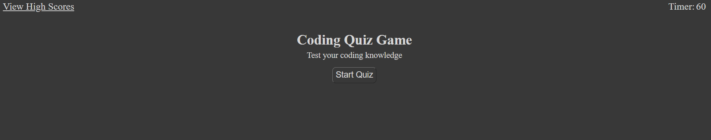
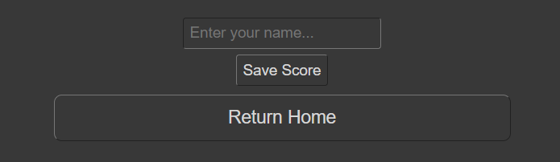

# JavaScript Quiz Game

Do you want to test your knowledge of JavaScript fundamentals?
 
Do you want to be able to save your score and compare it to your friends?
 
Cick [here](link) to launch the JavaScript Quiz Game

## How to play

* When you first launch the game, you will be directed to the main screen
* Click the Start Quiz button to begin the quiz
* Once the quiz has started you will have 60 seconds to answer all 10 questions
* If you get an answer incorrect the timer will deduct 5 seconds

* Once the quiz is completed, you will see your score
* Enter your name in the text box and click the Save Score button to save your score
* Click the Return Home button, and have somebody else repeat the previous steps

* Once you have cycled through playing with friends, click the "View High Scores" link in the top left corner of the page
* Here you will see a list ordered from the highest score to the lowest

## Credits

[CSS Child Combinator](https://developer.mozilla.org/en-US/docs/Web/CSS/Child_combinator)

[How To: Stop Countdown Timer](https://www.javatpoint.com/javascript-timer#:~:text=JavaScript%20offers%20two%20functions%20clearTimeout,stop%20the%20code%20execution%20beforehand.)

[JSON](https://www.w3schools.com/js/js_json.asp)

[Get legnth of nested object](https://stackoverflow.com/questions/43118645/get-length-of-nested-javascript-object)

[Deducting time from a timer](https://stackoverflow.com/questions/60370557/how-can-you-deduct-10-seconds-from-a-running-timer-in-javascript)

[How to remove an element in JavaScript](https://developer.mozilla.org/en-US/docs/Web/API/Element/remove)

[Submitting a from in JS](https://www.freecodecamp.org/news/how-to-submit-a-form-with-javascript/)

[Sorting an array of objects](https://stackoverflow.com/questions/979256/sorting-an-array-of-objects-by-property-values)